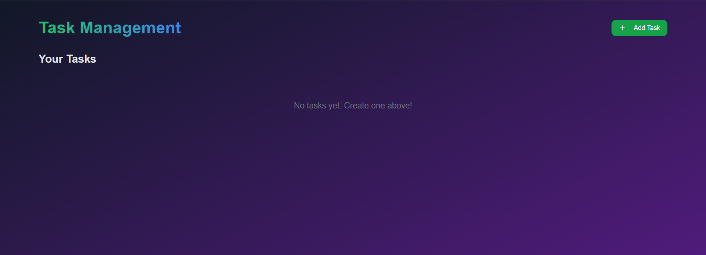
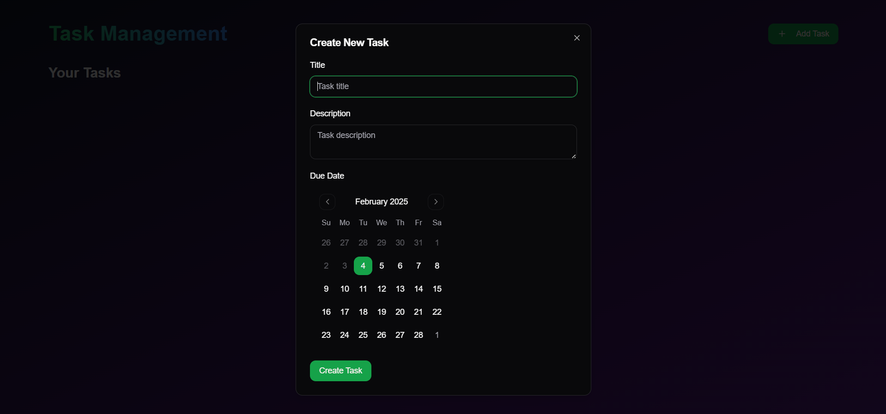
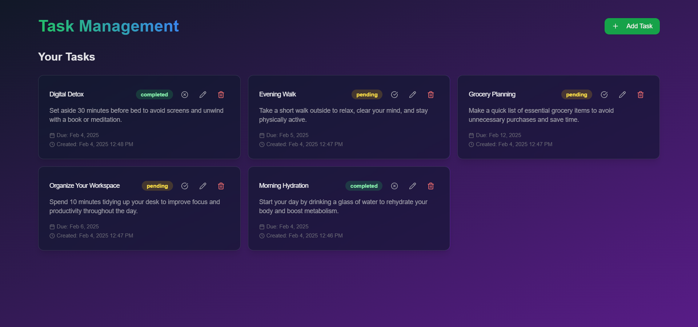

# Task Management Application

A modern task management application built with Next.js 15, featuring server actions and MongoDB integration. The application allows users to manage tasks with create, read, update, and delete operations.


## 🌟 Features

- **Task Operations**
  - Create new tasks
  - View existing tasks
  - Edit task details
  - Delete tasks
  - Mark tasks as complete/incomplete

- **Task Details**
  - Title
  - Description
  - Due date
  - Status tracking
  - Creation timestamp

- **Modern UI/UX**
  - Responsive design
  - Glass morphism effects
  - Dark theme
  - Smooth animations
  - Toast notifications

## Screenshots





## 🛠️ Tech Stack

- **Frontend**: Next.js 15(latest version)
- **Backend**: Next.js Server Actions
- **Database**: MongoDB
- **Styling**: Tailwind CSS
- **UI Components**: shadcn/ui
- **Form Handling**: React Hook Form
- **Validation**: Zod
- **Database ODM**: Mongoose
- **Deployment**: Vercel

## 🚀 Getting Started

### Prerequisites

- Node.js 18+ 
- MongoDB database (local or Atlas)
- npm or yarn

### Installation

1. Clone the repository:

```bash
npm run dev
# or
yarn dev
# or
pnpm dev
# or
bun dev
```

Open [http://localhost:3000](http://localhost:3000) with your browser to see the result.

You can start editing the page by modifying `app/page.tsx`. The page auto-updates as you edit the file.

This project uses [`next/font`](https://nextjs.org/docs/app/building-your-application/optimizing/fonts) to automatically optimize and load [Geist](https://vercel.com/font), a new font family for Vercel.

## Learn More

To learn more about Next.js, take a look at the following resources:

- [Next.js Documentation](https://nextjs.org/docs) - learn about Next.js features and API.
- [Learn Next.js](https://nextjs.org/learn) - an interactive Next.js tutorial.

You can check out [the Next.js GitHub repository](https://github.com/vercel/next.js) - your feedback and contributions are welcome!

## Deploy on Vercel

The easiest way to deploy your Next.js app is to use the [Vercel Platform](https://vercel.com/new?utm_medium=default-template&filter=next.js&utm_source=create-next-app&utm_campaign=create-next-app-readme) from the creators of Next.js.

Check out our [Next.js deployment documentation](https://nextjs.org/docs/app/building-your-application/deploying) for more details.
